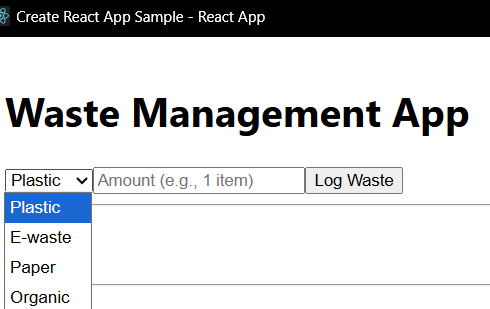
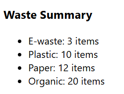
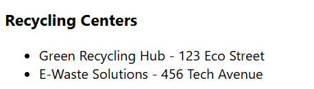

# ♻️ Waste Management Tracker

[](https://waste-management-tracker.netlify.app/)

🌍 **Live Demo**: [waste-management-tracker.netlify.app](https://waste-management-tracker.netlify.app/)

📝 **DevPost Project**: https://devpost.com/software/waste-management-app-plastic-e-waste-tracking-system  

---

## 📌 Project Overview
A React-based web application that helps users **track plastic & e-waste**, view a **weekly summary**, and find **nearby recycling centers**.  

Built to raise environmental awareness and encourage sustainable disposal habits.  
Deployed on **Netlify** with automatic CI/CD from GitHub.  

---

## ✨ Features
- **Waste Logging** – log daily waste by type (Plastic, E-waste, Paper, Organic).  
- **Waste Summary** – weekly tracking with item counts and simple summaries.  
- **Recycling Directory** – static list of nearby recycling centers (expandable later with maps API).  
- **Eco-Friendly UI** – minimal green/white theme to encourage sustainable habits.  

---

## 🛠️ Tech Stack
- **Frontend**: React (Create React App)  
- **State Management**: React useState hook  
- **Storage**: LocalStorage (MVP)  
- **Deployment**: Netlify  

---

## 📂 Project Structure
```
src/
  components/
    WasteLogger.js
    WasteSummary.js
    RecyclingCenters.js
  App.js
```

---

## 🚀 Getting Started

### 1. Clone the repo
```bash
git clone https://github.com/anneliza2008/waste-management-app.git
cd waste-management-app
```

### 2. Install dependencies
```bash
npm install
```

### 3. Run locally
```bash
npm start
```
App runs at: [http://localhost:3000](http://localhost:3000)

### 4. Build for production
```bash
npm run build
```

---

## 📸 Screenshots

**Waste Logger**


**Waste Summary**


**Recycling Centers**


---

## 📜 License
This project is licensed under the [MIT License](./LICENSE).  